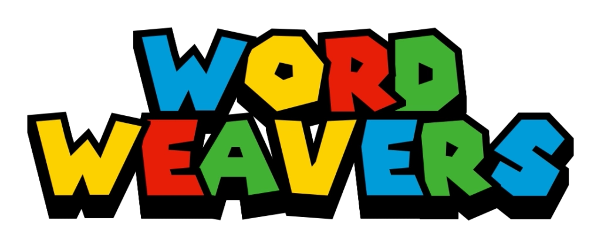

<div align="center">

# <a href="https://wordweavershccci.online"></a>

[](https://opensource.org/licenses/MIT)
[](https://php.net/)
[](https://www.docker.com/)
[](https://www.mysql.com/)

A comprehensive web-based educational platform developed by Group 3 Computer Science Seniors at Holy Cross College of Carigara Incorporated in partial fulfillment of the requirements for the degree of Bachelor of Science in Computer Science. This interactive platform, created under the thesis titled "Developing Educational Games for High School Language Arts: Design Principles and Effectiveness," helps learners improve their English skills through immersive language arts web games featuring vocabulary building, grammar challenges, and social learning features.

</div>

## Project Overview


**Word Weavers** is designed to help Junior High School students (Grades 7-10) learn English in a fun and engaging way, following the **Philippine K-12 Curriculum** standards set by DepEd. Through interactive games, students can improve their vocabulary, grammar, reading comprehension, and communication skills while actually enjoying the learning process. The platform tracks student progress and provides meaningful insights, making it easier for both students and teachers to see real learning outcomes that align with K-12 assessment standards.

## Key Features

### Public Access

- Secure user registration with email verification
- OTP-based authentication system
- Real-time progress tracking and GWA (Grade Weighted Average) calculation
- Global leaderboards and achievement system
- Interactive game selection interface

### Game Experiences

- **Vocabworld**: Top-down educational vocabulary RPG with level-based progression
- Character customization and progression system
- Save/load game functionality
- Multiple game worlds and environments
- Auto-detection currency system (Essence & Shards)
- **Grammar Heroes**: Interactive grammar challenges (coming soon)

### Social Features

- Profile avatar
- Friends system with request management
- Favorites and bookmarking system
- Global Leaderboards
- Real-time notification system

### Teacher Console

- Vocabulary wordbank management
- Student management
- Real-time student performance analytics
- Individual student GWA monitoring

### Admin Console

- User moderation and management
- Profile management tools
- System analytics and reporting
- Complete platform oversight

## Quick Start

###  With Docker (Recommended)

```bash
git clone https://github.com/frostjade71/GameDev-G1 GameDev-G1
cd GameDev-G1
docker-compose up -d
```

Access the application:

- **Web Interface**: http://localhost:8080
- **phpMyAdmin**: http://localhost:8081

Access the application at `http://localhost/GameDev-G1`

> **Security Note**: Configure your email settings in `onboarding/otp/send_otp.php` for OTP verification!

## Game System

The platform implements an engaging educational game ecosystem:

### Vocabworld Features

1. **Character Selection**: Choose from Ethan, Emma, Amber, and more characters
2. **Currency System**: Dual currency with Essence and Shards
3. **Level Progression**: Advance through vocabulary challenges
4. **Save System**: Persistent game progress
5. **Multiple Worlds**: Diverse game environments

### Progression Rules

- **GWA Tracking**: Automatic grade calculation based on performance
- **Achievement System**: Unlock badges and rewards through gameplay
- **Leaderboard Rankings**: Compete globally with other learners
- **Social Integration**: Share progress and compare with friends

## Technology Stack

<p align="center">
  
</p>

## Configuration

### Database Setup

Edit `onboarding/config.php` with your credentials:

```php
define('DB_HOST', 'localhost');
define('DB_USER', 'your_username');
define('DB_PASS', 'your_password');
define('DB_NAME', 'school_portal');
```

### Docker Environment

The Docker setup uses these environment variables:

- `DB_HOST=db`
- `DB_USER=root`
- `DB_PASS=rootpassword`
- `DB_NAME=school_portal`

### Email Configuration

Configure PHPMailer in `onboarding/otp/send_otp.php` for OTP verification.

## Security Features

- **Password Hashing**: bcrypt encryption for all passwords
- **Prepared Statements**: PDO with parameterized queries
- **Input Sanitization**: All user inputs are sanitized and validated
- **Session Management**: Secure session handling with HTTP-only cookies
- **Email Verification**: OTP-based account verification
- **SQL Injection Prevention**: Prepared statements throughout the application

## Usage Guide

1. **Register**: Create a new account and verify your email via OTP
2. **Profile Setup**: Complete your profile information
3. **Select Game**: Choose from available game modes
4. **Character Selection**: Pick your character and customize
5. **Play & Learn**: Progress through vocabulary challenges
6. **Track Progress**: Monitor your GWA and achievements
7. **Social Features**: Connect with friends and compare progress
8. **Favorites**: Bookmark content for quick access

## Contributing

We welcome contributions! Because i cant do this alone lmao.

1. Fork the repository
2. Create a feature branch (`git checkout -b feature/NewFeature`)
3. Commit your changes (`git commit -m 'Add NewFeature'`)
4. Push to the branch (`git push origin feature/NewFeature`)
5. Open a Pull Request

## License

This project is licensed under the MIT License. See the [LICENSE](LICENSE.md) file for details.

---

## **Credits**  Group 3 Computer Science Seniors

> #### Documentation & QA/Testers:

- Alfred Estares
- Loren Mae Pascual
- Jeric Ganancial
- Ria Jhen Boreres
- Ken Erickson Bacarisas

> #### **Developer**

- **Jaderby Peñaranda**

  [](https://gravatar.com/jaderbypenaranda) [](mailto:jaderbypenaranda@gmail.com)

---

<div align="left">
  
  <span><b>Word Weavers</b></span>
  <span style="margin-left: 10px;"><i>Empowering Learners Through Interactive Education</i></span>
</div>

---

**Version**: 2.0.0
**Last Updated**: January 26, 2026
