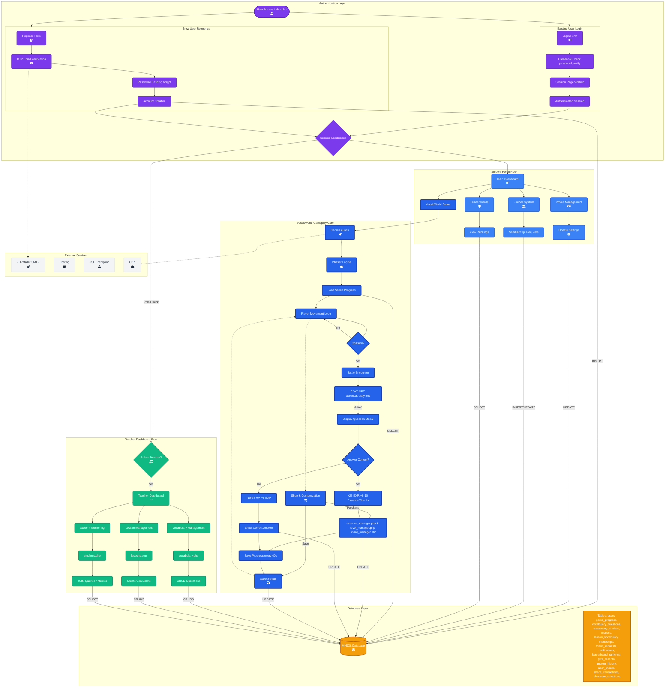

# Word Weavers System Architecture

Since the image generation service is currently experiencing high traffic, I have created a comprehensive **Mermaid.js** architecture diagram. This has the added benefit of being version-controllable and editable.

## Architecture Flowchart

## How to View
You can view this diagram in any Markdown viewer that supports Mermaid.js (like GitHub, GitLab, VS Code, or Obsidian).

### Key Legend
- **Purple**: Authentication & Security
- **Blue**: Student Portal & Features
- **Highlighted Blue**: Core Gameplay Loop
- **Green**: Teacher Administration
- **Orange**: Database Persistence
- **Shapes**:
  - Rounded Box: Process/Page
  - Cylinder: Database
  - Diamond: Decision Point
  - Dashed Line: Async/AJAX connection
